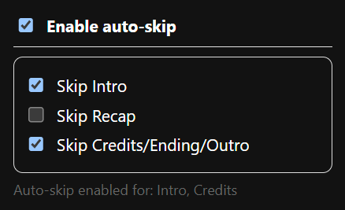

# Crunchyroll Auto Skip


**Crunchyroll Auto Skip** is a Chrome extension that automatically clicks the **Skip Intro**, **Skip Recap**, and **Skip Credits** buttons on Crunchyroll video player pages — so you can watch without interruptions.

## ✨ Features

- ⏭ **Auto-skip intros** when the button appears  
- 🔄 **Auto-skip recaps** at the start of episodes  
- 🎬 **Auto-skip credits/endings/outros** at the end  
- 🎚 **Per-feature toggles** in the popup UI (choose which skip actions are active)  
- ⚡ Works in embedded player iframes & Shadow DOM elements  
- 🖱 Minimal, robust DOM scanning (fast and safe)  
- 📦 No data collection, no external calls — fully local

---

## 📷 Screenshots

**Popup UI**



<!-- **Example on Crunchyroll**

 -->

---

## 🔧 Installation (Local Development)

You can install and test the extension locally before publishing to the Chrome Web Store.

1. **Clone or download** this repository  
   ```bash
   git clone https://github.com/yourusername/crunchyroll-auto-skip.git
   cd crunchyroll-auto-skip
   ```

2. **Open Chrome Extensions page**  
   Go to [`chrome://extensions`](chrome://extensions) and enable **Developer mode** (top right).

3. **Load unpacked extension**  
   Click **Load unpacked** and select the folder containing:
   ```
   manifest.json
   content.js
   popup.html
   popup.js
   icons/
   ```

4. **Test it**  
   Open a Crunchyroll episode (`https://www.crunchyroll.com/watch/...`), wait for a Skip button to appear, and watch it click automatically.

---

## ⚙ How It Works

- The content script (`content.js`) runs on Crunchyroll watch pages **and** on same-origin player iframes (`all_frames: true`).
- It scans for skip buttons by:
  - Looking for `aria-label` attributes like `"Skip Intro"`, `"Skip Recap"`, `"Skip Credits"`
  - Checking `data-testid="skipIntroText"` labels
  - Searching Shadow DOMs for these elements
- When found, it clicks the visible button if that feature is enabled in the popup.
- The popup (`popup.html` + `popup.js`) stores user preferences in `chrome.storage.sync`, so settings persist across tabs and devices.

---

## 🛡 Permissions

- `storage` — to save your per-feature toggle settings
- `host_permissions` — for `https://*.crunchyroll.com/*` and `https://*.vrv.co/*` to run on the video player pages/frames

---

## 📄 Privacy Policy

This extension **does not** collect, store, or transmit any personal data.  
All processing happens locally in your browser.

---

## 📜 License

Apache License — see [LICENSE](LICENSE) for details.

---

## 🤝 Contributing

Contributions are welcome!  
Feel free to:
- Open issues for bugs or feature requests
- Submit pull requests with improvements
- Suggest UI/UX tweaks for the popup or icon set

---

## ⭐ Acknowledgments

- [Crunchyroll](https://www.crunchyroll.com) — for the content we love
- [Chrome Extensions Docs](https://developer.chrome.com/docs/extensions/) — for the development guidance
